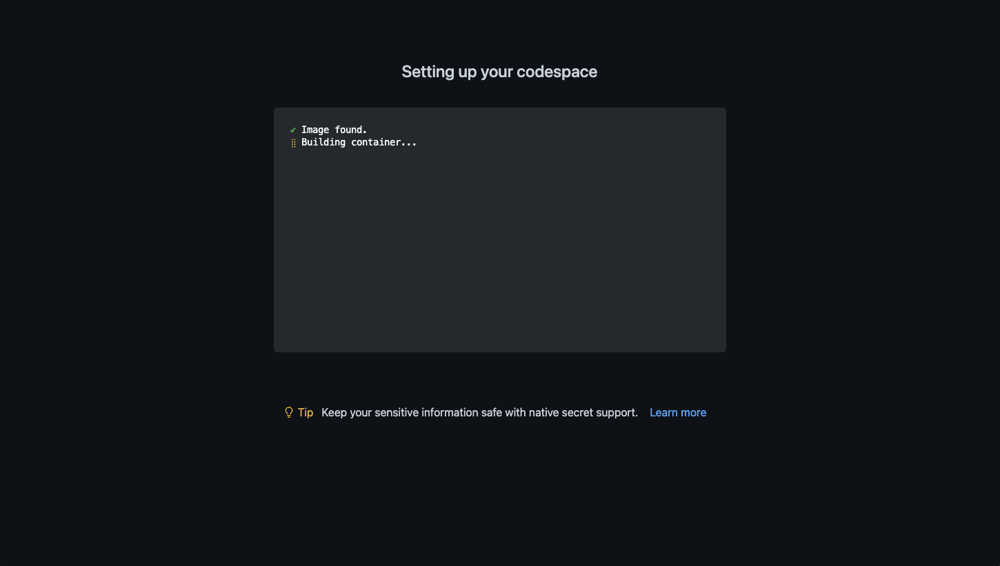
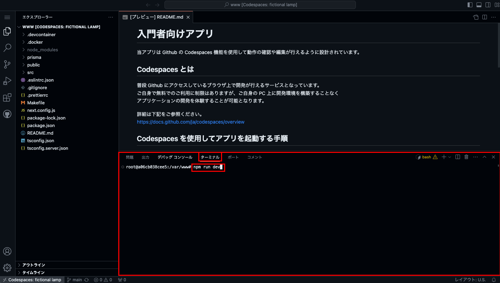

# 学習用教材: Next.js チュートリアル その① 〜 HTML を表示してみよう〜

HTML は画面に様々な要素を表示し、意味を付与していくことができますが、<br />
それだけでは非常に簡素な見た目となってしまいます。

近年作成される Web サイトは非常にデザイン性が高く、それを実現するために必要な技術が CSS (Cascading Style Sheets) と呼ばれる技術になります。<br />
非常に幅広い設定ができ、数年レベルで新たな仕様などが追加されたりもするため、すべてを網羅するのは現役のエンジニアでも不可能なほどです。

今回も Next.js フレームワークを使用して簡単なデザインを手順にそって実装し、その技術を体験してみましょう。<br />
また、画面を表示するブラウザで使用できる「開発ツール」の使い方も学び、これからの学習に活かしていきましょう！

## 動かし方

当アプリは Github の Codespaces 機能を使用して動作の確認や編集が行えるように設計されています。

### Codespaces とは

普段 Github にアクセスしているブラウザ上で開発が行えるサービスとなっています。  
ご自身で無料でのご利用に制限はありますが、ご自身の PC 上に開発環境を構築することなく  
アプリケーションの開発を体験することが可能となります。

詳細は下記をご参照ください。  
https://docs.github.com/ja/codespaces/overview

### Codespaces を使用してアプリを起動する手順

#### 1. 新規スペースを作成する

まずはじめに新規スペースを作成してエディタを立ち上げます。

以下画面を参考にし、当リポジトリの「Use this template」ボタンをクリックして「Open in a codespace」をクリックしてください。


※ 画像に表示されている画面は当リポジトリではありません

以下画面に切り替わり、開発環境が自動で構築されます。



※ 構築が完了するまで数分かかる場合があります。

#### 2. ターミナルでアプリの起動コマンドを実行する

1 でスペースの作成が完了すると、コードを編集するためのエディタが表示されます。

エディタ下部にあるターミナル画面に以下コマンドを入力してエンターキーで実行し、アプリケーションを起動してください。

```
npm run dev
```



#### 3. 起動したアプリをブラウザで確認する

2 でアプリの起動が完了すると、右下に以下のようなポップアップが表示されますので「ブラウザーで開く」をクリックしましょう。


上記が表示されない場合は以下の画像を参考にエディター下部の「ポート」タブから「3000」番のポートを探し、地球儀アイコンをクリックすることでも開くこともできます。


ブラウザで開いたら下記画面が表示されれば起動成功になります！


※ 画像に表示されている画面はアプリによって異なります
